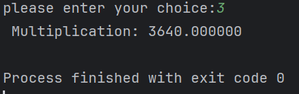

# Calculator 

---

## Introduction
This is a simple program that will calculate the adding,subtracting,multiplying and even division of two numbers.

---
## Process of development

Originally, it was a bare bones simple program with integers being passed through functions and limited edge casing.Later in development, I decided to I decided to change plans and use floats as this will give a greater acuracccy as well handle the fact if you divide it will give you the mod oof the two integers instead.

Deeper into development, I refactored my program and made the program cleaner by tidying up the looping system , edge casing as well handling the programs comments to make sure all the importnant parts of the programs are explained cleanly.

---

## Features

- Supports four operations: Add, Subtract, Multiply, Divide
- Handles division by zero
- Input validation for floats
- Easy-to-navigate menu-driven interface
- Clean modular code using functions

---

## Test run
This is what you will see if you ran the program and inputted the two numbers for the program.

As you can see if the two numbers are valid  then you will be displayed with the options page which will show you all the types of operations you can do/

In this hypothetical scenario, lets say you wanted to multiple your numbers together then as you can see in the image blow it will send you the response and then end the program

